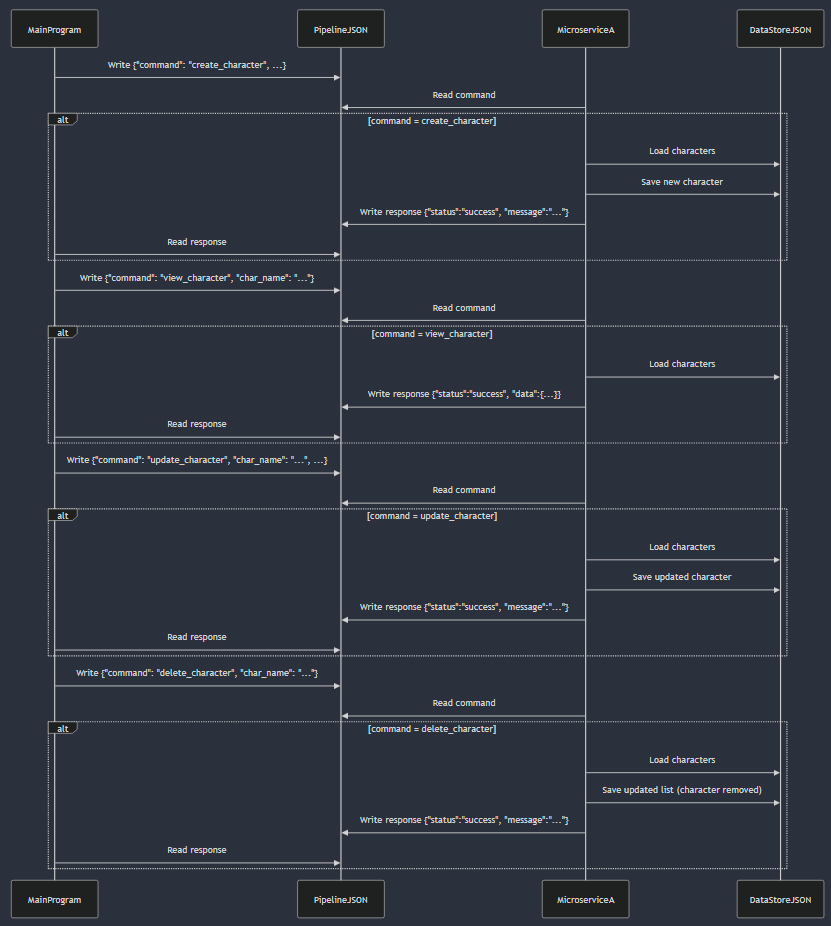

# Microservice A - Character Management

**Author**: Aiden Hosford 
**Teammate**: Jakob Poore

This microservice manages a collection of characters. It allows:
- **Create** a character
- **View** a specific character
- **Update** an existing character
- **Delete** an existing character

It communicates via **JSON files**. Specifically:
- `pipeline.json` acts as a **request/response** pipeline.
- `data_store.json` stores the character data.

---

## Communication Contract

### Overview

1. **Request**: Another program (the “main program”) writes JSON to `pipeline.json`.
2. **Response**: This microservice reads that JSON, performs the requested action, and writes a response to `pipeline.json`. The response
only contains the "data" parameter if it is a view (read) action.

#### Request Example call

    request_data = {
      "command": "create_character",
      "char_name": "HeroA",
      "role": "Vanguard",
      "review": "Brave and daring.",
      "ranking": "A"
    }
    
    with open("pipeline.json", "w") as f:
        json.dump(request_data, f, indent=2)

#### Response Example Call

    import time
    import json

    time.sleep(2)  # wait for microservice to process
    
    with open("pipeline.json", "r") as f:
        data = json.load(f)
    response_data = data.get("response")
    
    if response_data:
        print("Status:", response_data.get("status"))
        print("Message:", response_data.get("message"))

    if response_data.get("data"):
        print("Character data:", response_data["data"])

### Request Format

Depending on the desired action, the JSON must specify a `command` plus any **required parameters**:

#### 1. Create Character
    {
      "command": "create_character",
      "char_name": "<string>",
      "role": "<string>",
      "review": "<string>",
      "ranking": "<string>" 
    }

#### 2. View (read) Character
    {
      "command": "view_character",
      "char_name": "<string>"
    }

#### 3. Update Character
    {
      "command": "update_character",
      "char_name": "<string>",
      "role": "<string>",
      "review": "<string>",
      "ranking": "<string>"
    }

#### 4. Delete Character
    {
      "command": "delete_character",
      "char_name": "<string>"
    }

### Response Format
    {
      "command": "", 
      "response": {
        "status": "",
        "message": "",
        "data": ""
      }
    }

1. **command**: cleared or set to an empty string to indicate it has been processes
2. **status**: success or error
3. **message**: a message describing the result
4. **data**: If reading data includes the name, role, review, and ranking of the character.

## UML Sequence Diagram

